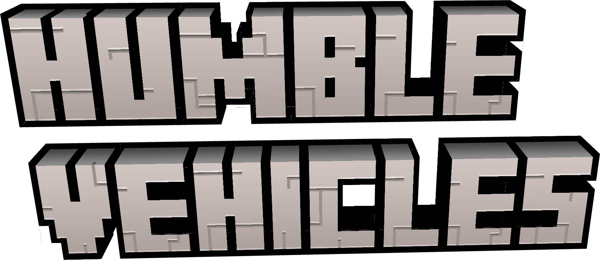

# Humble Vehicles Mod for Minecraft NeoForge

This is a NeoForge port of [LittleLogistics](https://littlelogistics.murad.dev/).

## Project goals

* learn Minecraft modding (+learn more Kotlin)
* have fun with rideable trains and ships in a vanilla setting
* use as much vanilla stuff a possible

## Features

- Trains with train cars
    - transport entities, items, fluids
    - routing AI
    - collision avoidance AI
- Tugs with barges
    - transport players, items, fluids
    - routing AI
    - fish automatically

- [Recipes](./recipes/readme.md) in markdown

## Next Steps

- [ ] get the port running in minecraft server and client without NPEs, all items, blocks etc. appearing (bugs allowed). See https://gist.github.com/ChampionAsh5357/d895a7b1a34341e19c80870720f9880f

### License

#### Source Code / java files

LGPLv3
https://www.gnu.org/licenses/lgpl-3.0.en.html
