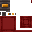

# Humble Vehicles Recipes

 __all original Minecraft icons (c) 2020 Microsoft Corporation__

 __other icons (c) Little Logistics__

## Tug Dock

Requires: humblevehicles:spring

Type: crafting

Ingredients: 
* c:stones
* humblevehicles:spring
* minecraft:iron_ingot

Pattern: 

| | | |
| --- | --- | --- |
|  |  |  |
|  |  |  |
|  |  |  |

## Barge Dock

Requires: humblevehicles:spring

Type: crafting

Ingredients: 
* c:stones
* humblevehicles:spring
* minecraft:iron_ingot

Pattern: 

| | | |
| --- | --- | --- |
|  |  |  |
|  |  |  |
|  |  |  |

## Vehicle Detector

Requires: humblevehicles:spring

Type: crafting

Ingredients: 
* c:stones
* humblevehicles:spring
* minecraft:redstone_torch

Pattern: 

| | | |
| --- | --- | --- |
|  |  |  |
|  |  |  |
|  |  |  |

## Vessel Corner Guide Rail

Requires: minecraft:powered_rail

Type: crafting

Ingredients: 
* humblevehicles:spring
* c:stones
* minecraft:powered_rail

Pattern: 

| | | |
| --- | --- | --- |
|  |  |  |
|  |  |  |
|  |  |  |

## Switch Rail

Requires: minecraft:rail

Type: crafting

Ingredients: 
* minecraft:rail

Pattern: 

| | |
| --- | --- |
|  |  |
|  |  |
|  |  |

## T-Junction Rail

Requires: minecraft:rail

Type: crafting

Ingredients: 
* minecraft:rail

Pattern: 

| | | |
| --- | --- | --- |
|  |  |  |
|  |  |  |

## Junction Rail

Requires: minecraft:rail

Type: crafting

Ingredients: 
* minecraft:rail

Pattern: 

| | | |
| --- | --- | --- |
|  |  |  |
|  |  |  |
|  |  |  |

## Locomotive Docking Rail

Requires: minecraft:rail

Type: crafting

Ingredients: 
* humblevehicles:spring
* minecraft:rail

Pattern: 

| |
| --- |
|  |
|  |
|  |

## Train Car Docking Rail

Requires: minecraft:rail

Type: crafting

Ingredients: 
* minecraft:rail
* humblevehicles:spring

Pattern: 

| | | |
| --- | --- | --- |
|  |  |  |
|  |  |  |
|  |  |  |

## Tug Guide Rail

Requires: minecraft:powered_rail

Type: crafting

Ingredients: 
* humblevehicles:spring
* minecraft:powered_rail
* c:stones

Pattern: 

| | | |
| --- | --- | --- |
|  |  |  |
|  |  |  |
|  |  |  |

## Fluid Hopper

Requires: minecraft:hopper

Type: crafting

Ingredients: 
* minecraft:glass
* minecraft:hopper

Pattern: 

| | | |
| --- | --- | --- |
|  |  |  |
|  |  |  |

## Vehicle Charger

Requires: minecraft:redstone

Type: crafting

Ingredients: 
* minecraft:gold_ingot
* minecraft:iron_ingot
* minecraft:redstone_block

Pattern: 

| | | |
| --- | --- | --- |
|  |  |  |
|  |  |  |
|  |  |  |

## Vehicle Chain

Requires: minecraft:string

Type: crafting

Ingredients: 
* c:strings
* minecraft:iron_nugget

Pattern: 

| | | |
| --- | --- | --- |
|  |  |  |
|  |  |  |

## Tug Route

Requires: minecraft:redstone

Type: crafting

Ingredients: 
* minecraft:redstone
* minecraft:iron_nugget
* humblevehicles:transmitter_component

Pattern: 

| | | |
| --- | --- | --- |
|  |  |  |
|  |  |  |
|  |  |  |

## Locomotive Route

Requires: minecraft:redstone

Type: crafting

Ingredients: 
* minecraft:iron_nugget
* minecraft:redstone
* humblevehicles:transmitter_component

Pattern: 

| | | |
| --- | --- | --- |
|  |  |  |
|  |  |  |
|  |  |  |

## Steam Tug

Requires: minecraft:piston

Type: crafting

Ingredients: 
* minecraft:iron_ingot
* minecraft:piston
* minecraft:furnace

Pattern: 

| | | |
| --- | --- | --- |
|  |  |  |
|  |  |  |
|  |  |  |

## Energy Tug

Requires: minecraft:piston

Type: crafting

Ingredients: 
* minecraft:iron_ingot
* minecraft:piston
* humblevehicles:vessel_charger

Pattern: 

| | | |
| --- | --- | --- |
|  |  |  |
|  |  |  |
|  |  |  |

## Chest Barge

Requires: minecraft:chest

Type: crafting

Ingredients: 
* minecraft:stick
* minecraft:chest
* minecraft:iron_ingot

Pattern: 

| | | |
| --- | --- | --- |
|  |  |  |
|  |  |  |

## Barrel Barge

Requires: minecraft:barrel

Type: crafting

Ingredients: 
* minecraft:stick
* minecraft:barrel
* minecraft:iron_ingot

Pattern: 

| | | |
| --- | --- | --- |
|  |  |  |
|  |  |  |

## Item Collection Barge

Requires: minecraft:hopper

Type: crafting

Ingredients: 
* minecraft:ender_eye
* minecraft:hopper
* minecraft:iron_ingot

Pattern: 

| | | |
| --- | --- | --- |
|  |  |  |
|  |  |  |

## Seater Barge

Requires: minecraft:iron_ingot

Type: crafting

Ingredients: 
* minecraft:signs
* minecraft:wooden_stairs
* minecraft:iron_ingot

Pattern: 

| | | |
| --- | --- | --- |
|  |  |  |
|  |  |  |

## Auto-Fishing Barge

Requires: minecraft:fishing_rod

Type: crafting

Ingredients: 
* minecraft:fishing_rod
* minecraft:iron_ingot

Pattern: 

| | | |
| --- | --- | --- |
|  |  |  |
|  |  |  |

## Fluid Tank Barge

Requires: minecraft:glass

Type: crafting

Ingredients: 
* minecraft:glass
* minecraft:iron_ingot

Pattern: 

| | | |
| --- | --- | --- |
|  |  |  |
|  |  |  |
|  |  |  |

## Rapid Hopper

Requires: minecraft:hopper

Type: crafting

Ingredients: 
* minecraft:gold_ingot
* minecraft:hopper
* minecraft:redstone_block

Pattern: 

| | | |
| --- | --- | --- |
|  |  |  |
|  |  |  |

## Train Car

Requires: minecraft:iron_ingot

Type: crafting

Ingredients: 
* minecraft:planks
* minecraft:iron_ingot

Pattern: 

| | | |
| --- | --- | --- |
|  |  |  |
|  |  |  |

## Chest Train Car

Requires: humblevehicles:seater_car

Type: crafting

Ingredients: 
* minecraft:chest
* humblevehicles:seater_car

Pattern: 

| |
| --- |
|  |
|  |

## Barrel Train Car

Requires: humblevehicles:seater_car

Type: crafting

Ingredients: 
* minecraft:barrel
* humblevehicles:seater_car

Pattern: 

| |
| --- |
|  |
|  |

## Fluid Tank Train Car

Requires: humblevehicles:seater_car

Type: crafting

Ingredients: 
* minecraft:glass
* humblevehicles:seater_car

Pattern: 

| | | |
| --- | --- | --- |
|  |  |  |
|  |  |  |
|  |  |  |

## Energy Locomotive

Requires: humblevehicles:seater_car

Type: crafting

Ingredients: 
* minecraft:iron_ingot
* minecraft:piston
* humblevehicles:vessel_charger
* humblevehicles:seater_car

Pattern: 

| | | |
| --- | --- | --- |
|  |  |  |
|  |  |  |
|  |  |  |

## Steam Locomotive

Requires: humblevehicles:seater_car

Type: crafting

Ingredients: 
* minecraft:iron_ingot
* minecraft:piston
* minecraft:furnace
* humblevehicles:seater_car

Pattern: 

| | | |
| --- | --- | --- |
|  |  |  |
|  |  |  |
|  |  |  |

## Wireless Receiver Component

Requires: minecraft:ender_eye

Type: crafting

Ingredients: 
* minecraft:ender_eye
* minecraft:redstone
* minecraft:stone_slab

Pattern: 

| |
| --- |
|  |
|  |
|  |

## Wireless Transmitter Component

Requires: minecraft:ender_eye

Type: crafting

Ingredients: 
* minecraft:ender_pearl
* minecraft:glowstone_dust
* minecraft:stone_slab

Pattern: 

| |
| --- |
|  |
|  |
|  |

## Conductor's Wrench

Requires: humblevehicles:spring

Type: crafting

Ingredients: 
* humblevehicles:spring
* minecraft:iron_ingot
* minecraft:red_dye

Pattern: 

| | | |
| --- | --- | --- |
|  |  |  |
|  |  |  |
|  |  |  |

