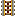
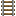
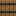
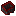

# Humble Vehicles Recipes

 __all original Minecraft icons (c) 2020 Microsoft Corporation__

 __other icons (c) Little Logistics__

## Tug Dock

Requires: [spring](#spring)

Type: crafting

Ingredients: 
* c:stones
* [spring](#spring)
* [iron_ingot](https://minecraft.wiki/w/iron_ingot)

Pattern: 

| | | |
| --- | --- | --- |
|  |  |  |
|  |  |  |
|  |  |  |

## Barge Dock

Requires: [spring](#spring)

Type: crafting

Ingredients: 
* c:stones
* [spring](#spring)
* [iron_ingot](https://minecraft.wiki/w/iron_ingot)

Pattern: 

| | | |
| --- | --- | --- |
|  |  |  |
|  |  |  |
|  |  |  |

## Vehicle Detector

Emits a redstone signal when a vessel is within 3 blocks in a given direction. Needs a straight line of water.

Requires: [spring](#spring)

Type: crafting

Ingredients: 
* c:stones
* [spring](#spring)
* [redstone_torch](https://minecraft.wiki/w/redstone_torch)

Pattern: 

| | | |
| --- | --- | --- |
|  |  |  |
|  |  |  |
|  |  |  |

## Vessel Corner Guide Rail

Requires: [powered_rail](https://minecraft.wiki/w/powered_rail)

Type: crafting

Ingredients: 
* [spring](#spring)
* c:stones
* [powered_rail](https://minecraft.wiki/w/powered_rail)

Pattern: 

| | | |
| --- | --- | --- |
|  |  |  |
|  |  |  |
|  |  |  |

## Switch Rail

Requires: [rail](https://minecraft.wiki/w/rail)

Type: crafting

Ingredients: 
* [rail](https://minecraft.wiki/w/rail)

Pattern: 

| | |
| --- | --- |
|  |  |
|  |  |
|  |  |

## T-Junction Rail

Requires: [rail](https://minecraft.wiki/w/rail)

Type: crafting

Ingredients: 
* [rail](https://minecraft.wiki/w/rail)

Pattern: 

| | | |
| --- | --- | --- |
|  |  |  |
|  |  |  |

## Junction Rail

Requires: [rail](https://minecraft.wiki/w/rail)

Type: crafting

Ingredients: 
* [rail](https://minecraft.wiki/w/rail)

Pattern: 

| | | |
| --- | --- | --- |
|  |  |  |
|  |  |  |
|  |  |  |

## Locomotive Docking Rail

Requires: [rail](https://minecraft.wiki/w/rail)

Type: crafting

Ingredients: 
* [spring](#spring)
* [rail](https://minecraft.wiki/w/rail)

Pattern: 

| |
| --- |
|  |
|  |
|  |

## Train Car Docking Rail

Requires: [rail](https://minecraft.wiki/w/rail)

Type: crafting

Ingredients: 
* [rail](https://minecraft.wiki/w/rail)
* [spring](#spring)

Pattern: 

| | | |
| --- | --- | --- |
|  |  |  |
|  |  |  |
|  |  |  |

## Tug Guide Rail

Requires: [powered_rail](https://minecraft.wiki/w/powered_rail)

Type: crafting

Ingredients: 
* [spring](#spring)
* [powered_rail](https://minecraft.wiki/w/powered_rail)
* c:stones

Pattern: 

| | | |
| --- | --- | --- |
|  |  |  |
|  |  |  |
|  |  |  |

## Fluid Hopper

A hopper but for fluids, can import from the top and export from the sides. Can be loaded by right-clicking with buckets. Can be used to load/unload vessels and train cars

Requires: [hopper](https://minecraft.wiki/w/hopper)

Type: crafting

Ingredients: 
* [glass](https://minecraft.wiki/w/glass)
* [hopper](https://minecraft.wiki/w/hopper)

Pattern: 

| | | |
| --- | --- | --- |
|  |  |  |
|  |  |  |

## Vehicle Chain

Used to link vessels or train cars together. Right click vehicles in order to create a train. A train can only have one tugboat/locomotive and cannot have loops. Will break if vehicles are far apart.

Requires: [string](https://minecraft.wiki/w/string)

Type: crafting

Ingredients: 
* c:strings
* [iron_nugget](https://minecraft.wiki/w/iron_nugget)

Pattern: 

| | | |
| --- | --- | --- |
|  |  |  |
|  |  |  |

## Tug Route

This item stores a route for the tug. When the item is placed in the tug’s route slot, the tug will follow the route in order from node 0.

Right click at any coordinate to add a node to the back of the tug route (cannot add to the middle). Right click at the location of any existing node to remove it. The nodes will be indicated with beams when the item is held in the main hand.

Requires: [redstone](https://minecraft.wiki/w/redstone)

Type: crafting

Ingredients: 
* [redstone](https://minecraft.wiki/w/redstone)
* [iron_nugget](https://minecraft.wiki/w/iron_nugget)
* [transmitter_component](#transmitter_component)

Pattern: 

| | | |
| --- | --- | --- |
|  |  |  |
|  |  |  |
|  |  |  |

## Locomotive Route

Requires: [redstone](https://minecraft.wiki/w/redstone)

Type: crafting

Ingredients: 
* [iron_nugget](https://minecraft.wiki/w/iron_nugget)
* [redstone](https://minecraft.wiki/w/redstone)
* [transmitter_component](#transmitter_component)

Pattern: 

| | | |
| --- | --- | --- |
|  |  |  |
|  |  |  |
|  |  |  |

## Steam Tug

Requires: [piston](https://minecraft.wiki/w/piston)

Type: crafting

Ingredients: 
* [iron_ingot](https://minecraft.wiki/w/iron_ingot)
* [piston](https://minecraft.wiki/w/piston)
* [furnace](https://minecraft.wiki/w/furnace)

Pattern: 

| | | |
| --- | --- | --- |
|  |  |  |
|  |  |  |
|  |  |  |

## Energy Tug

A tugboat powered by redstone. Charge it by placing redstone in the slot or by docking next to a hopper.

Requires: [piston](https://minecraft.wiki/w/piston)

Type: crafting

Ingredients: 
* [copper_ingot](https://minecraft.wiki/w/copper_ingot)
* [redstone_torch](https://minecraft.wiki/w/redstone_torch)
* [powered_rail](https://minecraft.wiki/w/powered_rail)
* [piston](https://minecraft.wiki/w/piston)
* [iron_ingot](https://minecraft.wiki/w/iron_ingot)

Pattern: 

| | | |
| --- | --- | --- |
|  |  |  |
|  |  |  |
|  |  |  |

## Chest Barge

Requires: [chest](https://minecraft.wiki/w/chest)

Type: crafting

Ingredients: 
* [stick](https://minecraft.wiki/w/stick)
* [chest](https://minecraft.wiki/w/chest)
* [iron_ingot](https://minecraft.wiki/w/iron_ingot)

Pattern: 

| | | |
| --- | --- | --- |
|  |  |  |
|  |  |  |

## Barrel Barge

Requires: [barrel](https://minecraft.wiki/w/barrel)

Type: crafting

Ingredients: 
* [stick](https://minecraft.wiki/w/stick)
* [barrel](https://minecraft.wiki/w/barrel)
* [iron_ingot](https://minecraft.wiki/w/iron_ingot)

Pattern: 

| | | |
| --- | --- | --- |
|  |  |  |
|  |  |  |

## Item Collection Barge

Automatically collects items in a radius

Connect a Chest Barge behind the Item Collection Barge, as the Item Collection Barge does not provide an inventory of its own.

Requires: [hopper](https://minecraft.wiki/w/hopper)

Type: crafting

Ingredients: 
* [ender_eye](https://minecraft.wiki/w/ender_eye)
* [hopper](https://minecraft.wiki/w/hopper)
* [iron_ingot](https://minecraft.wiki/w/iron_ingot)

Pattern: 

| | | |
| --- | --- | --- |
|  |  |  |
|  |  |  |

## Seater Barge

A simple barge that seats one player.

Requires: [iron_ingot](https://minecraft.wiki/w/iron_ingot)

Type: crafting

Ingredients: 
* [signs](https://minecraft.wiki/w/signs)
* [wooden_stairs](https://minecraft.wiki/w/wooden_stairs)
* [iron_ingot](https://minecraft.wiki/w/iron_ingot)

Pattern: 

| | | |
| --- | --- | --- |
|  |  |  |
|  |  |  |

## Auto-Fishing Barge

Performs fishing passively, uses vanilla fishing rod loot table.

Needs to be in open water for nets to be deployed. Use on long routes in open oceans to avoid "shallow water" and "overfishing" penalties. Connect a Chest Barge behind the Auto-Fishing Barge, as the Auto-Fishing Barge does not provide an inventory of its own.

Requires: [fishing_rod](https://minecraft.wiki/w/fishing_rod)

Type: crafting

Ingredients: 
* [fishing_rod](https://minecraft.wiki/w/fishing_rod)
* [iron_ingot](https://minecraft.wiki/w/iron_ingot)

Pattern: 

| | | |
| --- | --- | --- |
|  |  |  |
|  |  |  |

## Fluid Tank Barge

Use this barge to transport fluids, can be loaded with a Fluid Hopper.

Requires: [glass](https://minecraft.wiki/w/glass)

Type: crafting

Ingredients: 
* [glass](https://minecraft.wiki/w/glass)
* [iron_ingot](https://minecraft.wiki/w/iron_ingot)

Pattern: 

| | | |
| --- | --- | --- |
|  |  |  |
|  |  |  |
|  |  |  |

## Train Car

Requires: [iron_ingot](https://minecraft.wiki/w/iron_ingot)

Type: crafting

Ingredients: 
* [planks](https://minecraft.wiki/w/planks)
* [iron_ingot](https://minecraft.wiki/w/iron_ingot)

Pattern: 

| | | |
| --- | --- | --- |
|  |  |  |
|  |  |  |

## Chest Train Car

A simple train car that holds items, similar to chest minecart.

The car must be docked and part of a tug-train to interface with hoppers.

Requires: [seater_car](#seater_car)

Type: crafting

Ingredients: 
* [chest](https://minecraft.wiki/w/chest)
* [seater_car](#seater_car)

Pattern: 

| |
| --- |
|  |
|  |

## Barrel Train Car

Requires: [seater_car](#seater_car)

Type: crafting

Ingredients: 
* [barrel](https://minecraft.wiki/w/barrel)
* [seater_car](#seater_car)

Pattern: 

| |
| --- |
|  |
|  |

## Fluid Tank Train Car

Use this train car to transport fluids, can be loaded with a Fluid Hopper.

Requires: [seater_car](#seater_car)

Type: crafting

Ingredients: 
* [glass](https://minecraft.wiki/w/glass)
* [seater_car](#seater_car)

Pattern: 

| | | |
| --- | --- | --- |
|  |  |  |
|  |  |  |
|  |  |  |

## Energy Locomotive

A locomotive powered by redstone. Charge it by placing redstone in the slot or by docking next to a hopper.

Requires: [seater_car](#seater_car)

Type: crafting

Ingredients: 
* [copper_ingot](https://minecraft.wiki/w/copper_ingot)
* [redstone_torch](https://minecraft.wiki/w/redstone_torch)
* [powered_rail](https://minecraft.wiki/w/powered_rail)
* [piston](https://minecraft.wiki/w/piston)
* [iron_ingot](https://minecraft.wiki/w/iron_ingot)
* [seater_car](#seater_car)

Pattern: 

| | | |
| --- | --- | --- |
|  |  |  |
|  |  |  |
|  |  |  |

## Steam Locomotive

A basic locomotive that can operate on any furnace fuel.

Fuel can be loaded with hoppers placed beside docking rails

Requires: [seater_car](#seater_car)

Type: crafting

Ingredients: 
* [iron_ingot](https://minecraft.wiki/w/iron_ingot)
* [piston](https://minecraft.wiki/w/piston)
* [furnace](https://minecraft.wiki/w/furnace)
* [seater_car](#seater_car)

Pattern: 

| | | |
| --- | --- | --- |
|  |  |  |
|  |  |  |
|  |  |  |

## Wireless Receiver Component

Requires: [ender_eye](https://minecraft.wiki/w/ender_eye)

Type: crafting

Ingredients: 
* [ender_eye](https://minecraft.wiki/w/ender_eye)
* [redstone](https://minecraft.wiki/w/redstone)
* [stone_slab](https://minecraft.wiki/w/stone_slab)

Pattern: 

| |
| --- |
|  |
|  |
|  |

## Wireless Transmitter Component

Requires: [ender_eye](https://minecraft.wiki/w/ender_eye)

Type: crafting

Ingredients: 
* [ender_pearl](https://minecraft.wiki/w/ender_pearl)
* [glowstone_dust](https://minecraft.wiki/w/glowstone_dust)
* [stone_slab](https://minecraft.wiki/w/stone_slab)

Pattern: 

| |
| --- |
|  |
|  |
|  |

## Conductor's Wrench

Held in the hand, the Conductor's wrench will display the locations of currently registered locomotives and tugs.

Right clicking any rails will cycle it through various rail shapes.

Requires: [spring](#spring)

Type: crafting

Ingredients: 
* [spring](#spring)
* [iron_ingot](https://minecraft.wiki/w/iron_ingot)
* [red_dye](https://minecraft.wiki/w/red_dye)

Pattern: 

| | | |
| --- | --- | --- |
|  |  |  |
|  |  |  |
|  |  |  |

## submarine

This vehicle is powered by redstone and can dive underwater. Press left ctrl to give it downward thrust.

Requires: [piston](https://minecraft.wiki/w/piston)

Type: crafting

Ingredients: 
* [glass](https://minecraft.wiki/w/glass)
* [redstone_torch](https://minecraft.wiki/w/redstone_torch)
* [copper_ingot](https://minecraft.wiki/w/copper_ingot)
* [powered_rail](https://minecraft.wiki/w/powered_rail)
* [piston](https://minecraft.wiki/w/piston)
* [iron_ingot](https://minecraft.wiki/w/iron_ingot)

Pattern: 

| | | |
| --- | --- | --- |
|  |  |  |
|  |  |  |
|  |  |  |

